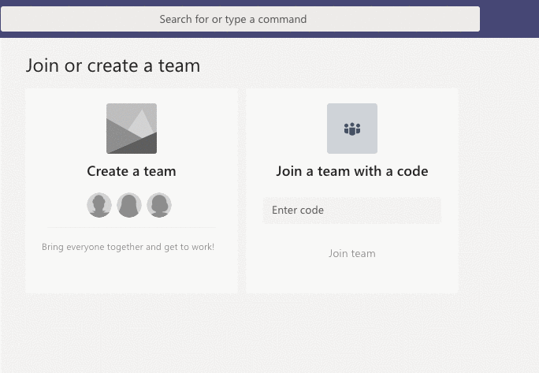

# HA-Beskrivende-Statistik-2018
Roman Jurowetzki, Ph.D.; Assistant Professor in Innovation Studies and Data Science; roman@business.aau.dk

## Rules of the Game

- Kommunikation: [Microsoft :confused: Teams](http://teams.microsoft.com/)
- Resourser: [Github](https://github.com/RJuro/HA-Beskrivende-Statistik-2018)
- Training: [Datacamp](http://datacamp.com/)
- Tools: [Google Sheets](https://www.google.com/sheets/about/), Måske [Jupyter/R](https://notebooks.azure.com/)
- Eksamen: [Peergrade](https://www.peergrade.io/)


#### [Microsoft :confused: Teams](http://teams.microsoft.com/):
Join Code **8cul5da**

Vi kommer til at bruge Teams til at kommunikere. Teams er lige som *Slack* et system til modern og professionel kommunikation. I kan bruge Teams også senere til projektarbejde mm. Nogle vejledere her på AAU bruger det allerede.
Jeg åbnede et *team* til vores kursus. Her sender jeg updates



#### [Github](https://github.com/RJuro/HA-Beskrivende-Statistik-2018):
Moodle (AAU's installation) er :unamused: især når man arbejder meget med IT og kode. Github er en platform social softwareudvikling og mere som ofte bruges til undervisning. Vi skal nok ikke skrive kode her på 1. semester men for jer, der har interesse i nye teknologier, IT etc. giver det måske en mulighed at udforske en ny platform (der ikke er FB eller Insta).
Der vil ligge alle formalia omkring kursus på Moodle men resourcer er nok i kursets Github repo.

#### [Datacamp](http://datacamp.com/)
Datacamp er en online Data Science træning platform, der har mest fokus på R og Python, SQL etc. Jeg har skaffet gratis adgang til jer.
Alle af jer **SKAL** gennemføre 2 kurser
- Spreadsheet Basics
- Data Analysis with Spreadsheets
Endvidere åbner jeg for kurser under forløbet "Intro to Statistics with R", "Data Visualization with R" og

[](http://www.youtube.com/watch?v=US_raZCfJAM)


---
title: "R Notebook"
output: html_notebook
---

This is an [R Markdown](http://rmarkdown.rstudio.com) Notebook. When you execute code within the notebook, the results appear beneath the code. 

Try executing this chunk by clicking the *Run* button within the chunk or by placing your cursor inside it and pressing *Cmd+Shift+Enter*. 

```{r}
plot(cars)
```

Add a new chunk by clicking the *Insert Chunk* button on the toolbar or by pressing *Cmd+Option+I*.

When you save the notebook, an HTML file containing the code and output will be saved alongside it (click the *Preview* button or press *Cmd+Shift+K* to preview the HTML file). 

The preview shows you a rendered HTML copy of the contents of the editor. Consequently, unlike *Knit*, *Preview* does not run any R code chunks. Instead, the output of the chunk when it was last run in the editor is displayed.
